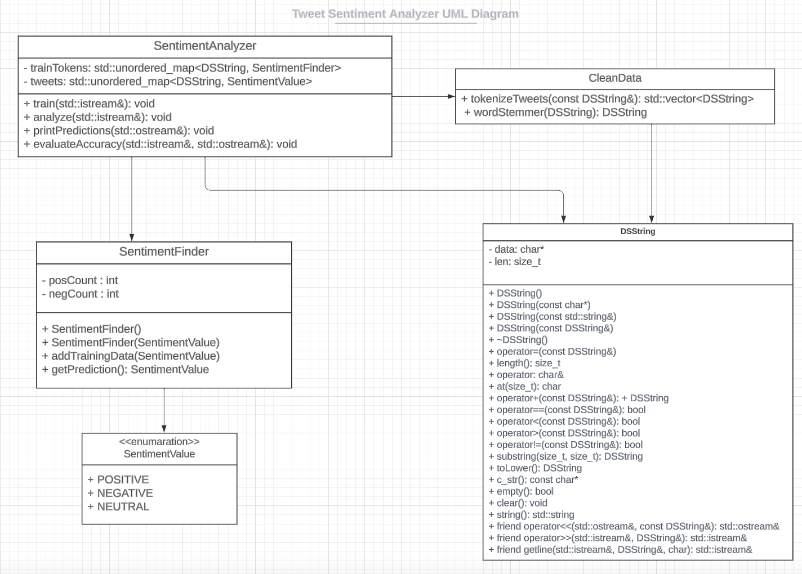

# Assignment 2: Answers

**Complete this document, commit your changes to Github and submit the repository URL to Canvas.** Keep your answers short and precise.

Your Name:

Used free extension: [ ] 24 hrs or [ ] 48 hrs

[x] Early submission (48 hrs)

[x] Bonus work. Describe: ...
   [x] stemming

Place [x] for what applies.

## UML Diagram

Add your UML class diagram here.

Replace the following image with your diagram. You can draw it by hand and take a photo.

## Answers

1. How do you train the model and how do you classify a new tweet? Give a short description of the main steps.

    > TRAINING: The train function is responsible for teaching the model about sentiment based on a dataset of labeled tweets. It reads in a dataset of tweets and their associated sentiments line by line from the input stream. For each line of data, it extracts the sentiment of the tweet (positive, negative, neutral). The train method maintains a data structure (trainTokens) to keep track of how often each word appears in positive and negative tweets. For each token in the tweet, it updates the sentiment information. These steps are repeated for all the tweets in the training dataset.

    > CLASSIFICATION: Once the code is trained, we can use it to predict the sentiment of new tweets(testing tweets). Just like the training function, the analyze function goes over tweets from the test dataset. It tokenizes and lowercases the tweet. For each token in the new tweet, it looks up the sentiment information learned during training to make a guess about whether each word is associated with a positive or negative sentiment. Depending on whether the overall sentiment score suggests positivity or negativity, it makes a guess about the sentiment of the new tweet. (SentimentFinder objects within the trainTokens container are used to classify words based on whether they are associated with positive or negative sentiment.)

Aggregate Sentiment: It calculates an overall sentiment score for the tweet based on the sentiment of its individual words.

2. How long did your code take for training and what is the time complexity of your training implementation (Big-Oh notation)? Remember that training includes reading the tweets, breaking it into words, counting, ... Explain why you get this complexity (e.g., what does `N` stand for and how do your data structures/algorithms affect the complexity).

   >  My training takes 1.67767 seconds. The complexity of the 'train' method can be analyzed as follows:
   >  1. Reading the file line by line.
   >  2. Tokenization of each tweet - Within the loop, I tokenize each tweet using the CleanData::tokenizeTweets function.
   >  3. Updating the trainTokens data structure.
   >  Time Complexity: O(n) | This is because the training function reads each line one by one and performs a constant number of operations for each line.

3. How long did your code take for classification and what is the time complexity of your classification implementation (Big-Oh notation)? Explain why.

   >  My testing takes 0.969057 seconds. The complexity of the 'test' method can be analyzed as follows:
   >  1. Read files one by one and tokenize the tweets just like the train funtion.
   >  2. Calculate Sentiment: For each word in the tweet, it checks if the word exists in the collection 'trainTokens'. If it does, it counts how many times the word is associated with positive and negative sentiments.
   >  3. Predict Sentiment: After analyzing all the words in the tweet, it calculates a score based on the total positive and negative counts. If the positive count is higher, it predicts a positive sentiment for that tweet. If the negative count is higher, it predicts a negative sentiment. It keeps track of how many tweets it predicts as positive and how many as negative.
   >  Time Complexity: O(n) | This is because the testing function reads each line one by one and performs a constant number of operations for each line.

4. How do you know that you use proper memory management? I.e., how do you know that you do not have
   a memory leak?

   >  Because everywhere where I use the "new" keyword, I delete the allocated data, unless I want the data to exist outside of the current scope. Testing with Valgrind shows that 'all heap blocks were freed' ( see at 'no_memory_leaks.txt' )

5. What was the most challenging part of the assignment?

   >  The most challenging part fo me was writing a proper getline function that I can pass in differrent arguments. I always had to go back and edit it.